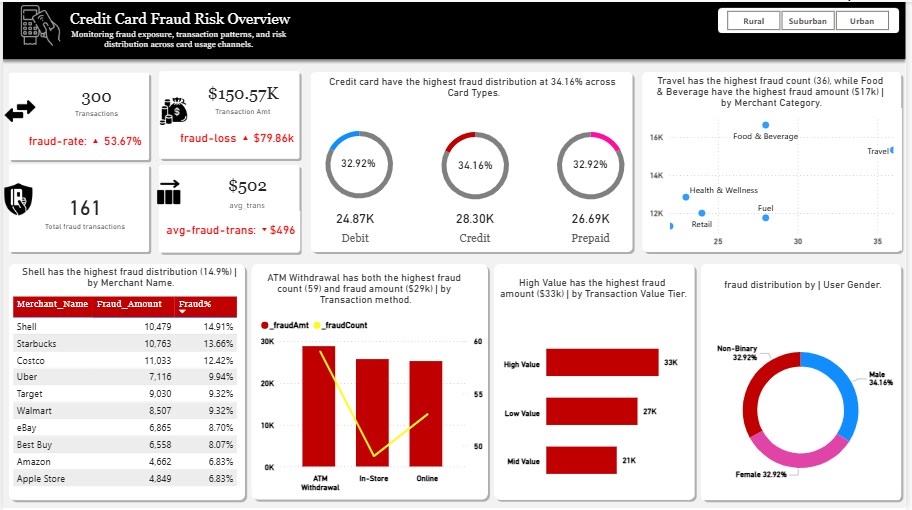
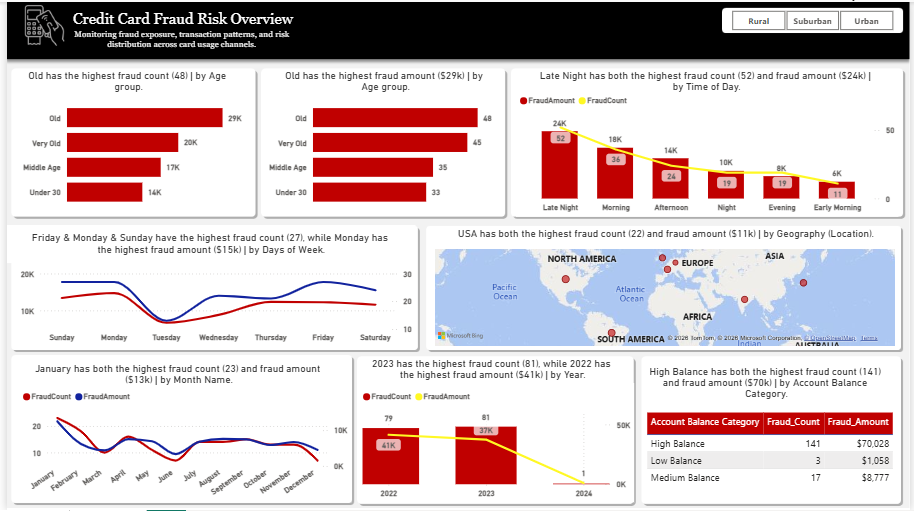

# Credit Card Fraud Risk Overview 


# Table of Contents

- [Objective](#Objective)
- [Questions](#Questions)
- [Tools](#Tools)
- [Methodology](#Methodology)
- [Dashboard](#Dashboard)
- [Insights](#Insights)
- [Recommendations](#Recommendations)


# Visualization





# Objective


## About This Project

This is a Power BI dashboard that tracks credit card fraud across 300 transactions. It looks at fraud by card type, merchant, payment method, time of day, customer age, account balance, and location. The goal is simple: find out where fraud is happening the most, and figure out what can be done about it.

---

## Key Numbers

- Total transactions: 300
- Total transaction amount: $150.57K
- Total fraud transactions: 161
- Fraud rate: 53.67%
- Total fraud loss: $79.86K
- Average fraud transaction: $496

---

## Insights

- Credit cards have the highest fraud share at 34.16%. Debit and Prepaid cards are close behind, both around 32.92%. All three card types are almost equally risky, none of them stands out as safe.

- Travel has the highest number of fraud cases (36), but Food & Beverage has the highest fraud amount ($17K). This means Travel fraud happens more often, but Food & Beverage fraud costs more per case.

- Shell tops the list at 14.91% of all fraud, followed by Starbucks (13.66%) and Costco (12.42%). These are everyday, well-known brands, not unusual or suspicious-looking merchants. This shows fraud often happens in normal, regular spending, not just in rare or risky purchases.

- ATM Withdrawal is the riskiest method, with both the highest fraud count (59 cases) and the highest fraud amount ($29K). Online and In-Store methods have lower fraud numbers in comparison.

- High Value transactions have the highest fraud amount at $33K, followed by Low Value ($27K) and Mid Value ($21K).

- Fraud is almost evenly spread across Male (34.16%), Female (32.92%), and Non-Binary (32.92%) customers. Gender does not appear to be a strong fraud indicator on its own.

- "Old" customers have both the highest fraud count (48) and the highest fraud amount ($29K), followed by "Very Old" (45 cases, $20K). Older age groups are clearly the most targeted.

- Late Night has both the highest fraud count (52) and fraud amount ($24K), followed by Morning (36 cases). Fraud drops steadily through the day and is lowest in the Early Morning.

- Friday, Monday, and Sunday have the highest fraud counts (27 each), but Monday has the highest fraud amount ($15K). Fraud dips noticeably mid-week (Tuesday to Thursday).

- The USA has both the highest fraud count (22) and fraud amount ($11K) compared to other regions shown on the map.

- January has both the highest fraud count (23) and fraud amount ($13K), making it the riskiest month in the data.

- 2023 has the highest fraud count (81), while 2022 has the highest fraud amount ($41K). This shows fraud cases went up in 2023, but the average loss per case was higher in 2022.

- High Balance accounts are by far the biggest concern, 141 fraud cases and $70,028 in losses. That is 87.6% of total fraud transactions and about 88% of total fraud losses, even though Low Balance and Medium Balance accounts only added up to $9,835 combined.

---

## Recommendations

- ATM Withdrawal has the highest fraud count and the highest fraud amount of any transaction method. This should be the first place to add extra security steps, such as additional verification for large or late-night withdrawals.

- High Balance accounts make up the large majority of both fraud cases and fraud losses. These accounts should get enhanced monitoring, such as real-time alerts for unusual activity or stricter approval steps for large transactions.

- Late Night has the highest fraud count and amount of any time period. Consider adding extra fraud checks, automatic transaction holds, or real-time alerts specifically for transactions made during these hours.

- "Old" and "Very Old" age groups are the most affected by fraud. This group may benefit from extra education on fraud prevention, simplified fraud reporting tools, or proactive alerts when unusual activity is detected on their accounts.

- These three days consistently show higher fraud activity. If fraud monitoring teams have flexible staffing, consider increasing coverage on these specific days.

---


# ProjectOverview

A financial institution is experiencing increasing fraudulent credit card activities across multiple transaction channels, merchants, and countries.

The business wants to:

Identify patterns associated with fraudulent transactions
Detect high-risk customer and merchant behaviors
Understand how fraud varies across geography, card types, transaction methods, and customer demographics
Improve fraud monitoring and risk mitigation strategies

Using SQL, the objective is to analyze transaction data and generate actionable business insights that can support fraud prevention and operational decision-making.

# Tools


# Methodology

```sql

--bq1: Fraud overview and financial impact.

SELECT 
	SUM([Transaction_Amount]) AS Total_Fraud_Amount,
	AVG([Transaction_Amount]) AS Average_Transaction_Amount
FROM dbo.credit_card_fraud_detection
WHERE Fraudulent = 1;			

--- | total fraud transactions and fraud rate | ---

WITH FR AS ( SELECT 
				COUNT(*) AS Fraud_Count, 
				COUNT(*) * 100.0 / (SELECT COUNT(*) FROM dbo.credit_card_fraud_detection) AS Fraud_Rate
	FROM dbo.credit_card_fraud_detection
	WHERE Fraudulent = 1
) SELECT Fraud_Count, CAST(Fraud_Rate AS DECIMAL (10,2) ) AS Fraud_Rate_Percentage
FROM FR;			


--- | fraud & non-fraud transactions | ---

SELECT 
	COUNT(CASE WHEN [Fraudulent] = 1 THEN 1 ELSE 0 END) AS YF
FROM credit_card_fraud_detection;


--- bq2: High risk transactions methods. Transaction methods with the highest fraud rates and finacial impacts.
SELECT
    Transaction_Method,
    COUNT(CASE WHEN Fraudulent = 1 THEN 1 END) AS Fraud_Count,
    COUNT(*) AS Total_Transactions,
    ROUND(
        COUNT(CASE WHEN Fraudulent = 1 THEN 1 END) * 100.0
        / COUNT(*), 2
    ) AS Fraud_Rate,
    ROUND(
        SUM(CASE WHEN Fraudulent = 1 THEN Transaction_Amount ELSE 0 END), 2
    ) AS Fraud_Amount
FROM dbo.credit_card_fraud_detection
GROUP BY Transaction_Method
ORDER BY Fraud_Rate DESC;


--- bq3: Fraudulent transactions by MC. MC WITH THE HIGHEST NUMBER OF FRAUDULENT TRANSACTIONS AND THEIR FINANCIAL IMPACTS.

SELECT 
	[Merchant_Category],
	ROUND(AVG([Transaction_Amount]), 2) AS Avg_Fraud_Amount_By_MC,
	COUNT(*) AS Total_Fraudulent_by_MC, 
	CAST(COUNT(*) AS DECIMAL (10, 2)) * 100 / 
(SELECT COUNT(*) FROM dbo.credit_card_fraud_detection) AS Fraud_Rate_Percentage_by_MC
FROM dbo.credit_card_fraud_detection
WHERE Fraudulent = 1
GROUP BY [Merchant_Category];

--- bq4 : COUNTRY LEVEL FRAUD ANALYSIS.	

SELECT [Country],
	COUNT(*) AS CountryFraud,
	SUM([Account_Balance] - [Transaction_Amount]) AS Total_Loss_By_Country,
	COUNT(*) * 100.0 / (SELECT COUNT(*) FROM dbo.credit_card_fraud_detection) AS Country_Fraud_Rate
FROM dbo.credit_card_fraud_detection
WHERE Fraudulent = 1
GROUP BY [Country]
ORDER BY CountryFraud DESC;

--- bq5: OVERTIME FRAUD TRENDS.

SELECT 
	COUNT(*) AS Fraudulent_Transactions,
	SUM(COUNT(*)) OVER (ORDER BY YEAR(Transaction_Date), MONTH(Transaction_Date)) AS Cumulative_Fraudulent_Transactions,
	DATENAME(MONTH, Transaction_Date) AS Fraudulent_Transactions_By_Month,
	DATENAME(YEAR, Transaction_Date) AS Fraudulent_Transactions_By_Year
FROM dbo.credit_card_fraud_detection
WHERE Fraudulent = 1
GROUP BY 
	YEAR(Transaction_Date),
	MONTH(Transaction_Date),
	DATENAME(MONTH, Transaction_Date),
	DATENAME(YEAR, Transaction_Date)
ORDER BY YEAR(Transaction_Date), MONTH(Transaction_Date);--Fraudulent_Transactions_By_Day;


-- bq6: Which card types are most vulnerable to frudulent transactions?

SELECT COUNT(*) AS Fraudulent_Transactions_By_Card_Type, 
	[Card_Type],
	ROUND(SUM([Transaction_Amount]), 2) AS Fraud_Amount_By_Card_Type,
	CAST(COUNT(*) AS DECIMAL (10, 2)) * 100 / (SELECT COUNT(*) FROM dbo.credit_card_fraud_detection)   AS Fraud_Rate_Percentage_By_Card_Type
FROM dbo.credit_card_fraud_detection
WHERE Fraudulent = 1
GROUP BY [Card_Type]
ORDER BY Fraudulent_Transactions_By_Card_Type DESC;

-- bq7: Which customer demographics are associated with higher fraud exposure?

SELECT 
    [Country],
    [Transaction_Location],
    [User_Gender],
    CASE 
        WHEN [User_Age] BETWEEN 18 AND 25 THEN 'Under 25'
        WHEN [User_Age] BETWEEN 26 AND 35 THEN 'Young Age'
        WHEN [User_Age] BETWEEN 36 AND 45 THEN 'Middle Age'
        WHEN [User_Age] BETWEEN 46 AND 65 THEN 'Old Age'
        ELSE 'Very Old Age'
        END AS Age_Group,
    COUNT(*) AS Fraudulent_Transactions,
    ROUND(SUM([Transaction_Amount]), 2) AS Total_Fraud_Amount
FROM dbo.credit_card_fraud_detection
WHERE Fraudulent = 1
GROUP BY [Country], [Transaction_Location],[User_Gender],
         CASE 
            WHEN [User_Age] BETWEEN 18 AND 25 THEN 'Under 25'
            WHEN [User_Age] BETWEEN 26 AND 35 THEN 'Young Age'
            WHEN [User_Age] BETWEEN 36 AND 45 THEN 'Middle Age'
            WHEN [User_Age] BETWEEN 46 AND 65 THEN 'Old Age'
            ELSE 'Very Old Age'
         END;


-- bq8: Do fraudulent transactions tend to involve higher transaction amounts?

SELECT      
        'Fraud' AS Metric,
        ROUND(SUM([Transaction_Amount]), 2) AS Total_Distribution_Amount,
        ROUND(AVG([Transaction_Amount]), 2) AS Average_Transaction_Amount,
        ROUND(MAX([Transaction_Amount]), 2) AS Max_Transaction_Amount,
        ROUND(MIN([Transaction_Amount]), 2) AS Min_Transaction_Amount
FROM dbo.credit_card_fraud_detection
WHERE Fraudulent = 1

UNION ALL 

SELECT      
        'Normal' AS Metric,
         ROUND(SUM([Transaction_Amount]), 2) AS Total_Distribution_Amount,
         ROUND(AVG([Transaction_Amount]), 2) AS Average_Transaction_Amount,
         ROUND(MAX([Transaction_Amount]), 2) AS Max_Transaction_Amount,
         ROUND(MIN([Transaction_Amount]), 2) AS Min_Transaction_Amount
FROM dbo.credit_card_fraud_detection
WHERE Fraudulent = 0;

 
 -- high value transactions.

SELECT                                                     
         [Country], 
         'High Value' AS Transaction_Status,
         ROUND(SUM([Transaction_Amount]), 2) AS Total_Fraud_Amount
FROM dbo.credit_card_fraud_detection
WHERE Fraudulent = 1 AND [Transaction_Amount] >= 800
GROUP BY [Country]

                                UNION ALL

SELECT 
        [Country], 
        'Mid Value' AS Transaction_Status,
        ROUND(SUM([Transaction_Amount]), 2) AS Total_Fraud_Amount
FROM dbo.credit_card_fraud_detection
WHERE Fraudulent = 1 AND [Transaction_Amount] BETWEEN 600 AND 799
GROUP BY [Country]

                                UNION ALL

SELECT 
        [Country], 
        'Low Value' AS Transaction_Status,
        ROUND(SUM([Transaction_Amount]), 2) AS Total_Fraud_Amount
FROM dbo.credit_card_fraud_detection
WHERE Fraudulent = 1 AND [Transaction_Amount] < 600
GROUP BY [Country];


-- bq9: Which merchant generates the highest of fraudulent transactions & loss?

SELECT  
       [Merchant_Name],
       COUNT(*) AS Highest_Fraud_Transactions, 
       ROUND(SUM([Transaction_Amount]), 2) AS Fraud_Loss_Amount_By_Merchant
FROM dbo.credit_card_fraud_detection
WHERE Fraudulent = 1
GROUP BY [Merchant_Name]
ORDER BY Highest_Fraud_Transactions DESC; 


-- bq10: Is there a relationship between account balance and fraudulent transactions? 


SELECT [Merchant_Name],                                         
CASE 
    WHEN [Account_Balance] < 1000 THEN 'Low Balance'
    WHEN [Account_Balance] BETWEEN 1000 AND 5000 THEN 'Medium Balance'
    ELSE 'High Balance'
END AS Account_Balance_Category,
COUNT(*) AS Fraudulent_Transactions,
SUM([Transaction_Amount]) AS Total_Fraud_Amount
FROM dbo.credit_card_fraud_detection
WHERE Fraudulent = 1
GROUP BY [Merchant_Name], 
         CASE 
             WHEN [Account_Balance] < 1000 THEN 'Low Balance'
             WHEN [Account_Balance] BETWEEN 1000 AND 5000 THEN 'Medium Balance'
             ELSE 'High Balance'
         END;                                          

 -- average account balance for fraud victims.

SELECT                                          
    CAST(AVG([Account_Balance]) AS DECIMAL(10,2)) AS Average_Account_Balance_For_Fraudulent_Transactions
FROM dbo.credit_card_fraud_detection
WHERE Fraudulent = 1
GROUP BY [Merchant_Name];                              


-- bq11: Are there specific times of day when fraudulent transactions are more likely to occur?

WITH T1 AS ( SELECT 
    CASE 
        WHEN CAST(DATENAME(HOUR, [Transaction_Time]) AS INT) >= 22 
            OR CAST(DATENAME(HOUR, [Transaction_Time]) AS INT) <= 4 THEN 'Late Night'
        WHEN CAST(DATENAME(HOUR, [Transaction_Time]) AS INT) BETWEEN 19 AND 21 THEN 'Night'
        WHEN CAST(DATENAME(HOUR, [Transaction_Time]) AS INT) BETWEEN 16 AND 18 THEN 'Evening'
        WHEN CAST(DATENAME(HOUR, [Transaction_Time]) AS INT) BETWEEN 12 AND 15 THEN 'Afternoon'
        WHEN CAST(DATENAME(HOUR, [Transaction_Time]) AS INT) BETWEEN 7 AND 11 THEN 'Morning'
        ELSE 'Early Morning'
        END AS Transaction_Hour,
        [Transaction_Amount],
        Transaction_ID,
        Fraudulent 
FROM dbo.credit_card_fraud_detection
WHERE Fraudulent = 1 ), 

T2 AS ( SELECT  Transaction_Hour, 
                COUNT(*) AS Fraudulent_Transactions,
                ROUND(SUM([Transaction_Amount]), 2) AS Total_Fraud_Amount 
                FROM  T1
                GROUP BY Transaction_Hour )

SELECT Transaction_Hour, Fraudulent_Transactions, Total_Fraud_Amount
FROM T2
ORDER BY Fraudulent_Transactions DESC;


--bq12: which transaction locations are associated with the highest fraud occurrence?

SELECT [Country], [Transaction_Location],
        COUNT(*) AS Fraudulent_Locations,
        ROUND(SUM([Transaction_Amount]), 2) AS Total_Fraud_Amount_By_Location
FROM dbo.credit_card_fraud_detection
WHERE Fraudulent = 1
GROUP BY [Country], [Transaction_Location]
ORDER BY Fraudulent_Locations DESC;


```
